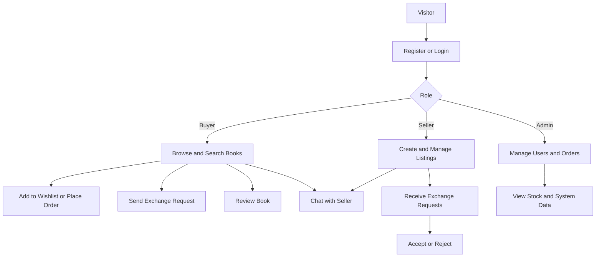
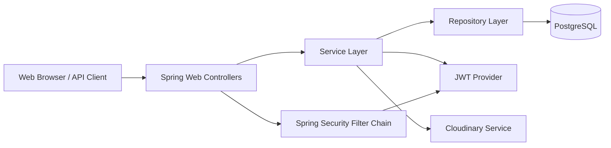

# ScholarShelf

ScholarShelf is a full-stack Spring Boot platform for buying, selling, and exchanging books. It combines a server-rendered web interface with REST APIs, role-based access control, and a containerized deployment workflow.

Live application: https://scholarshelf-hpra.onrender.com/

## Table of Contents

- Project Overview
- Key Features
- Tech Stack
- System Workflow Diagram
- Architecture Diagram
- ER Diagram
- Database Relationship Matrix
- API Endpoints
- Run Instructions
- Docker Setup
- Testing and CI/CD
- GitHub Branching and PR Requirements
- Hosting (Render)
- Default Seed Users
- Project Structure
- Contributing

## Project Overview

ScholarShelf supports three roles:

- Buyer: browse books, place orders, manage wishlist, send messages, create exchange requests, and submit reviews.
- Seller: list and manage books, handle incoming exchange requests, and communicate with buyers.
- Admin: monitor users and orders, and manage system-level operations.

The project is designed with clean layered architecture (Controller -> Service -> Repository -> Database), JWT-based stateless authentication for APIs, and a PostgreSQL-backed persistence layer.

## Key Features

- JWT authentication and authorization.
- Role-based access control (ADMIN, SELLER, BUYER).
- Book listing, search, and stock visibility.
- Order placement and status management.
- Exchange request workflow between buyers and sellers.
- Wishlist and review management.
- In-app messaging between users.
- Swagger/OpenAPI integration.
- Dockerized runtime with PostgreSQL.
- Automated CI pipeline using GitHub Actions.

## Tech Stack

- Backend: Spring Boot 4.0.3, Spring MVC, Spring Security, Spring Data JPA.
- Template Engine: Thymeleaf + Layout Dialect.
- Database: PostgreSQL 15.
- Auth: JWT (jjwt).
- Media: Cloudinary.
- Build Tool: Gradle 8.5.
- Java Version: 17.
- API Docs: springdoc-openapi.
- Testing: JUnit 5, Mockito, SpringBootTest, MockMvc.
- Containerization: Docker + Docker Compose.

## System Workflow Diagram

## Architecture Diagram

### Architectural Notes

- Web controllers (Thymeleaf pages) and API controllers coexist in the same application.
- Security is stateless for API requests using JWT.
- Business logic is centralized in services.
- Persistence is managed via Spring Data JPA repositories.

## ER Diagram

## Database Relationship Matrix

| Relationship                   | Type | Description                                                                                                     |
| ------------------------------ | ---- | --------------------------------------------------------------------------------------------------------------- |
| users -> books                 | 1:M  | One seller can list many books. Each book belongs to one seller.                                                |
| categories -> books            | 1:M  | One category can contain many books. Each book belongs to one category.                                         |
| users -> orders                | 1:M  | One buyer can place many orders. Each order belongs to one buyer.                                               |
| orders -> order_items          | 1:M  | One order contains multiple order items.                                                                        |
| books -> order_items           | 1:M  | One book can appear in many order items over time.                                                              |
| users -> reviews               | 1:M  | One user can write many reviews.                                                                                |
| books -> reviews               | 1:M  | One book can have many reviews.                                                                                 |
| users -> exchange_requests     | 1:M  | One buyer can create many exchange requests.                                                                    |
| books -> exchange_requests     | 1:M  | One book can receive many exchange requests.                                                                    |
| users -> messages (sender)     | 1:M  | One user can send many messages.                                                                                |
| users -> messages (receiver)   | 1:M  | One user can receive many messages.                                                                             |
| users <-> books (via wishlist) | M:M  | A user can wishlist many books, and a book can be wishlisted by many users through the `wishlist` join table. |

Notation guide:

- 1:M means one-to-many.
- M:1 means many-to-one (the inverse of 1:M).
- M:M means many-to-many.

## API Endpoints

Base URL (production): https://scholarshelf-hpra.onrender.com

### Authentication

- POST /api/v1/auth/register
- POST /api/v1/auth/login

### Books

- GET /api/v1/books/list
- GET /api/v1/books/search
- GET /api/v1/books/{id}
- GET /api/v1/books/{id}/stock
- GET /api/v1/books/my-books
- POST /api/v1/books
- PUT /api/v1/books/{id}
- DELETE /api/v1/books/{id}

### Exchange Requests

- POST /api/v1/exchanges
- GET /api/v1/exchanges/buyer
- GET /api/v1/exchanges/seller
- PUT /api/v1/exchanges/{id}/accept
- PUT /api/v1/exchanges/{id}/reject

### Messaging

- POST /api/v1/messages/{receiverId}
- GET /api/v1/messages/conversation/{userId}
- GET /api/v1/messages/partners

### Reviews

- POST /api/v1/reviews/book/{bookId}
- GET /api/v1/reviews/book/{bookId}

### Wishlist

- GET /api/v1/wishlist
- POST /api/v1/wishlist/{bookId}
- DELETE /api/v1/wishlist/{bookId}

### Orders

- POST /api/orders
- GET /api/orders/my
- POST /api/orders/{id}/accept
- POST /api/orders/{id}/cancel
- GET /api/orders/admin/all
- GET /api/orders/admin/stock-report
- POST /api/orders/admin/{id}/accept
- POST /api/orders/admin/{id}/cancel

### API Documentation

- Swagger UI: /swagger-ui
- OpenAPI JSON: /api-docs

For local development, open:

- http://localhost:8080/swagger-ui
- http://localhost:8080/api-docs

## Run Instructions

## Prerequisites

- Java 17
- Docker and Docker Compose (recommended path)
- PostgreSQL 15 (only for non-Docker local setup)

### Option A: Run with Docker (Recommended)

1. Clone the repository.
2. Create a .env file in the project root (if not present) with Cloudinary keys:

   CLOUDINARY_CLOUD_NAME=your_cloud_name
   CLOUDINARY_API_KEY=your_api_key
   CLOUDINARY_API_SECRET=your_api_secret
3. Start services:

   docker compose up --build -d
4. Open application:

   http://localhost:8080
5. Stop services:

   docker compose down

### Option B: Run Locally (Without Docker)

1. Ensure PostgreSQL is running.
2. Create database ScholarShelfDB.
3. Configure environment variables (or rely on defaults in application.properties):

- SPRING_DATASOURCE_URL
- SPRING_DATASOURCE_USERNAME
- SPRING_DATASOURCE_PASSWORD
- CLOUDINARY_CLOUD_NAME
- CLOUDINARY_API_KEY
- CLOUDINARY_API_SECRET

4. Start app:

   ./gradlew bootRun
5. Open:

   http://localhost:8080

## Docker Setup

This project is fully containerized:

- App container:

  - Multi-stage build using Gradle + JDK 17 for build phase.
  - Slim JRE runtime image for execution.
  - Exposes port 8080.
- Database container:

  - PostgreSQL 15.
  - Healthcheck ensures DB is ready before app starts.
- Volume:

  - Named volume persists PostgreSQL data between restarts.

## Testing and CI/CD

### Running Tests Locally

Run full test suite:

./gradlew test

### CI/CD Pipeline (GitHub Actions)

Workflow file: .github/workflows/ci.yml

Pipeline behavior:

- Triggered on:
  - push to main and develop
  - pull requests targeting main and develop
- Uses Java 17 on ubuntu-latest
- Spins up PostgreSQL 15 service for integration tests
- Runs build and tests with Gradle
- Publishes test reports
- Uploads build artifacts (JAR) on success
- Uploads logs/reports on failure for debugging

This ensures code quality and prevents regressions before changes are merged.

## GitHub Branching and PR Requirements

This project follows a structured Git workflow:

- `main`: protected production branch.
- `develop`: integration branch for validated features.
- `feature/*`: short-lived branches for individual tasks.

Governance rules:

- No direct push to `main`.
- Every change must go through a Pull Request.
- At least one review approval is required before merge.
- Recommended merge flow: `feature/*` -> `develop` -> `main`.

This strategy keeps production stable, enforces review quality, and maintains an auditable release path.

## Hosting (Render)

The application is deployed on Render and publicly available at:

- https://scholarshelf-hpra.onrender.com/

Deployment characteristics:

- Containerized runtime based on the project Dockerfile.
- Environment variables used for database and Cloudinary configuration.
- Production deployment follows the same app packaging model used in local containers.

## Default Seed Users

On startup, default users are initialized:

- Admin: admin@scholarshelf.com / password123
- Seller: seller@scholarshelf.com / password123
- Buyer: buyer@scholarshelf.com / password123

These are intended for development/testing and should be rotated in production.

## Project Structure

src/main/java/com/niloy/scholarshelf

- controller/api: REST endpoints
- controller/web: Thymeleaf web endpoints
- service: business logic
- repository: JPA repositories
- security: JWT and security configuration
- entity: domain model
- dto: request/response contracts
- config: bootstrap and configuration classes

src/main/resources

- templates: Thymeleaf pages
- static: CSS/JS assets
- application.properties: runtime configuration

If you are new to the project, start by running the Docker setup, logging in with a seeded user, and exploring Swagger UI to understand the API surface quickly.
